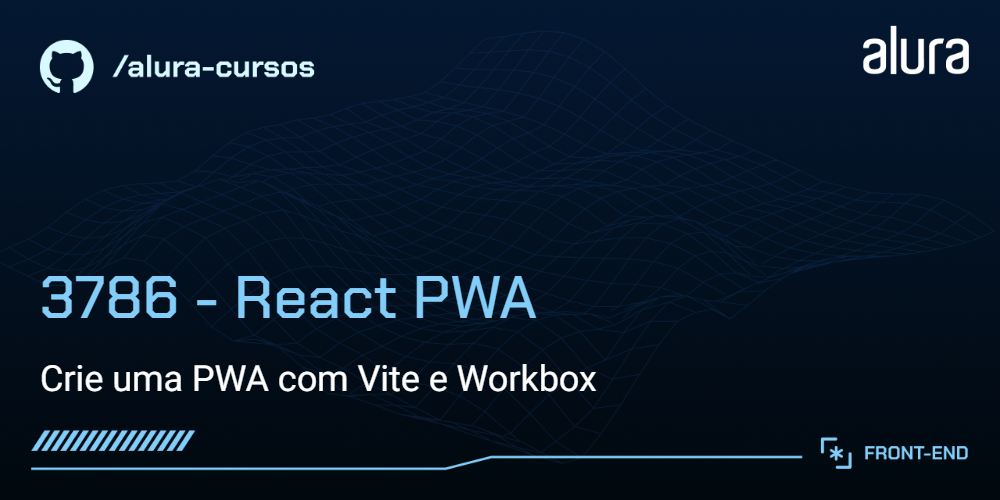

# Jornada Milhas

Explore o Jornada Milhas: seu guia de viagens para aventuras sem limites! Encontre inspiração, planeje suas jornadas e aproveite ofertas incríveis. Estamos em desenvolvimento e em breve, nossa funcionalidade PWA para acesso rápido em qualquer lugar!


## 🔨 Funcionalidades do projeto

Neste estágio de desenvolvimento, o site possui as seguintes funcionalidades:

- Página estática com pacotes de viagens
- Responsividade para diferentes dispositivos
- Outras funcionalidades em breve

O [Figma dessa aplicação você encontra aqui](https://www.figma.com/file/C9Hwa6VpPKLSM6pJVCMZgI/Jornada-Milhas-%7C-React-Service-Workers?type=design&node-id=0-1&mode=design&t=rZNRLbySPNz2Ugjf-0).

## ✔️ Técnicas e tecnologias utilizadas

O projeto utiliza as seguintes tecnologias e bibliotecas:

- `React` - Framework JavaScript
- `Vite` - Build tool para desenvolvimento rápido
- `VitePWA` - Plugin para criação de PWA's em aplicações com vite
- `Workbox` - Biblioteca para criação e gerenciamento de PWA's
- `JavaScript` - Linguagem de programação principal
- `Styled Components` - Ferramenta de estilização do nosso projeto
- `Figma` - Para prototipagem do projeto

E muito mais...

## 🛠️ Abrir e rodar o projeto

Para executar o projeto em seu ambiente local, siga estas etapas:

1. Certifique-se de ter o Node.js instalado em sua máquina. Nós usamos a versão 20.10.0

2. Baixe o repositório do projeto.

3. Extraia os arquivos para uma pasta de sua preferência.

4. Navegue até a pasta em questão via terminal (cmd):

```bash
cd react-pwa
```

5. Instale as dependências usando o npm:

```bash
npm install
```

6. Inicie o projeto localmente:

```bash
npm run dev
```

## 📚 Mais informações do curso

Gostou do projeto e quer conhecer mais?

O design e protótipo deste projeto podem ser encontrados [aqui](https://www.figma.com/file/C9Hwa6VpPKLSM6pJVCMZgI/Jornada-Milhas-%7C-React-Service-Workers?type=design&node-id=0-1&mode=design&t=rZNRLbySPNz2Ugjf-0). 

Aproveite o desenvolvimento e aprimoramento da Jornada Milhas!
